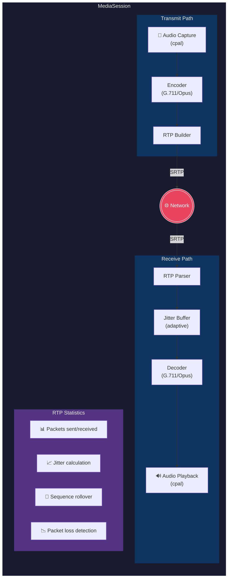
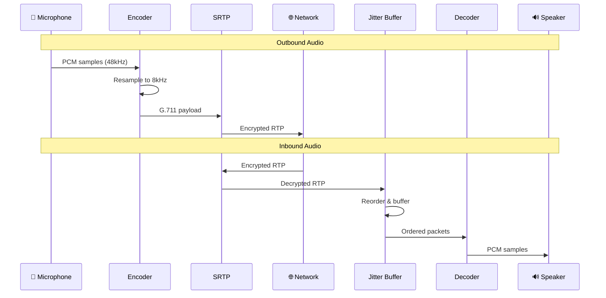

<p align="center">
  
</p>

<h1 align="center">rtp-engine</h1>

<p align="center">
A pure Rust RTP media engine for VoIP applications.<br>
Similar in scope to PJMEDIA, but designed from the ground up for Rust with modern async support.
</p>

<p align="center">
  <a href="https://crates.io/crates/rtp-engine"></a>
  <a href="https://docs.rs/rtp-engine"></a>
  
  <a href="LICENSE"></a>
  <a href="https://github.com/5060-Solutions/rtp-engine/actions"></a>
</p>

## Features

- **Audio Codecs**: G.711 μ-law (PCMU), G.711 A-law (PCMA), Opus
- **RTP/RTCP**: Complete packet construction, parsing, and statistics per RFC 3550
- **SRTP/SRTCP**: AES-CM-128-HMAC-SHA1-80 encryption per RFC 3711
- **Jitter Buffer**: Adaptive and fixed modes with packet reordering and loss concealment
- **Audio Devices**: Cross-platform capture and playback via cpal
- **Resampling**: Automatic sample rate conversion between codecs and devices
- **Symmetric RTP**: Comedia-style NAT traversal with learned endpoints
- **DTMF**: RFC 2833 telephone-event transmission
- **Sequence Rollover**: Proper 16-bit sequence number rollover handling for long calls (22+ minutes)

## Installation

Add to your `Cargo.toml`:

```toml
[dependencies]
rtp-engine = "0.1"
```

Or with specific features:

```toml
[dependencies]
rtp-engine = { version = "0.1", default-features = false, features = ["g711", "srtp"] }
```

## Quick Start

### Basic Media Session

```rust
use rtp_engine::{MediaSession, CodecType};
use std::net::SocketAddr;

#[tokio::main]
async fn main() -> Result<(), Box<dyn std::error::Error>> {
    let remote: SocketAddr = "192.168.1.100:5004".parse()?;
    
    // Start a media session with G.711 μ-law
    let session = MediaSession::start(10000, remote, CodecType::Pcmu).await?;
    
    // The session automatically:
    // - Captures audio from the default microphone
    // - Encodes with the specified codec
    // - Sends RTP packets to the remote endpoint
    // - Receives and decodes incoming RTP
    // - Plays audio to the default speaker
    
    // Send DTMF digit
    session.send_dtmf("1");
    
    // Mute/unmute microphone
    session.set_mute(true);
    session.set_mute(false);
    
    // Get real-time statistics
    let stats = session.stats();
    println!("Packets sent: {}", stats.packets_sent);
    println!("Packets received: {}", stats.packets_received);
    println!("Packets lost: {}", stats.packets_lost);
    println!("Jitter: {:.2}ms", stats.jitter_ms);
    
    // Stop the session
    session.stop();
    Ok(())
}
```

### With SRTP Encryption

```rust
use rtp_engine::{MediaSession, CodecType, SrtpContext};
use std::net::SocketAddr;

#[tokio::main]
async fn main() -> Result<(), Box<dyn std::error::Error>> {
    let remote: SocketAddr = "192.168.1.100:5004".parse()?;
    
    // Generate keying material for SDP offer
    let (srtp_ctx, key_material) = SrtpContext::generate()?;
    
    // Include in your SDP:
    // a=crypto:1 AES_CM_128_HMAC_SHA1_80 inline:{key_material}
    
    // Start encrypted session
    let session = MediaSession::start_with_srtp(
        10000,
        remote,
        CodecType::Pcmu,
        srtp_ctx,
    ).await?;
    
    // ... use session as normal
    
    session.stop();
    Ok(())
}
```

### Using Codecs Directly

```rust
use rtp_engine::codec::{CodecType, create_encoder, create_decoder};

fn main() -> Result<(), Box<dyn std::error::Error>> {
    // Create encoder and decoder
    let mut encoder = create_encoder(CodecType::Pcmu)?;
    let mut decoder = create_decoder(CodecType::Pcmu)?;
    
    // Encode 20ms of audio (160 samples at 8kHz)
    let pcm: Vec<i16> = vec![0; 160]; // Your audio samples
    let mut encoded = Vec::new();
    let samples_consumed = encoder.encode(&pcm, &mut encoded);
    
    // encoded now contains 160 bytes of G.711 data
    
    // Decode back to PCM
    let mut decoded = Vec::new();
    decoder.decode(&encoded, &mut decoded);
    
    // decoded now contains 160 i16 samples
    Ok(())
}
```

### Using the Jitter Buffer

```rust
use rtp_engine::{JitterBuffer, JitterConfig, JitterMode};

fn main() {
    // Create an adaptive jitter buffer
    let config = JitterConfig {
        mode: JitterMode::Adaptive {
            min_delay_ms: 20,
            max_delay_ms: 200,
            target_delay_ms: 60,
        },
        max_packets: 50,
        clock_rate: 8000,
    };
    
    let mut jitter_buf = JitterBuffer::new(config);
    
    // Push incoming RTP packets (can arrive out of order)
    jitter_buf.push(sequence_num, timestamp, payload.clone());
    
    // Pop packets in correct order for playout
    while let Some(packet) = jitter_buf.pop() {
        match packet {
            Some(data) => play_audio(&data),
            None => play_concealment_frame(), // Packet was lost
        }
    }
    
    // Get statistics
    let stats = jitter_buf.stats();
    println!("Packets received: {}", stats.packets_received);
    println!("Packets reordered: {}", stats.packets_reordered);
    println!("Packets lost: {}", stats.packets_lost);
}
```

### Building RTP Packets Manually

```rust
use rtp_engine::rtp::{RtpHeader, RtpPacket};

fn main() {
    // Create an RTP header
    let header = RtpHeader::new(
        0,          // payload type (PCMU)
        1234,       // sequence number
        160000,     // timestamp
        0xDEADBEEF, // SSRC
    ).with_marker(); // Set marker bit
    
    // Create a complete packet
    let packet = RtpPacket::new(header, payload_data);
    
    // Serialize to bytes
    let bytes = packet.to_bytes();
    
    // Parse received bytes
    if let Some(parsed) = RtpPacket::parse(&received_bytes) {
        println!("Seq: {}, TS: {}", parsed.header.sequence, parsed.header.timestamp);
    }
}
```

### SRTP Protection/Unprotection

```rust
use rtp_engine::SrtpContext;

fn main() -> Result<(), Box<dyn std::error::Error>> {
    // Create from base64 keying material (from SDP)
    let mut ctx = SrtpContext::from_base64("YWJjZGVmZ2hpamtsbW5vcHFyc3R1dnd4eXoxMjM0NTY=")?;
    
    // Protect (encrypt + authenticate) RTP
    let rtp_packet = build_rtp_packet();
    let srtp_packet = ctx.protect_rtp(&rtp_packet)?;
    
    // Unprotect (verify + decrypt) SRTP
    let decrypted = ctx.unprotect_rtp(&received_srtp)?;
    
    // Same for RTCP
    let srtcp = ctx.protect_rtcp(&rtcp_packet)?;
    let rtcp = ctx.unprotect_rtcp(&received_srtcp)?;
    
    Ok(())
}
```

## Feature Flags

| Feature | Default | Description |
|---------|---------|-------------|
| `g711` | ✓ | G.711 μ-law (PCMU) and A-law (PCMA) codecs |
| `opus` | ✓ | Opus codec with automatic resampling (requires libopus) |
| `srtp` | ✓ | SRTP/SRTCP encryption (AES-CM-128-HMAC-SHA1-80) |
| `device` | ✓ | Audio device capture and playback via cpal |

### Minimal Build

For embedded or server-side use without audio devices:

```toml
[dependencies]
rtp-engine = { version = "0.1", default-features = false, features = ["g711"] }
```

## Architecture



### Data Flow



## Module Overview

| Module | Description |
|--------|-------------|
| `codec` | Audio encoder/decoder traits and implementations (G.711, Opus) |
| `rtp` | RTP/RTCP packet construction, parsing, and statistics |
| `srtp` | SRTP encryption/decryption and SDP crypto attribute handling |
| `jitter` | Adaptive and fixed jitter buffer with loss concealment |
| `device` | Cross-platform audio capture and playback |
| `resample` | Sample rate conversion utilities |
| `session` | High-level `MediaSession` that orchestrates everything |

## Supported Platforms

| Platform | Audio Backend | Status |
|----------|---------------|--------|
| macOS | CoreAudio | ✓ Tested |
| Linux | ALSA / PulseAudio | ✓ Tested |
| Windows | WASAPI | ✓ Tested |
| iOS | CoreAudio | Should work (untested) |
| Android | AAudio / OpenSL ES | Should work (untested) |

## Performance

- **Codec latency**: < 1ms for G.711, ~2.5ms for Opus
- **Jitter buffer**: Configurable 20-200ms adaptive delay
- **Memory**: ~50KB per active session (excluding audio buffers)
- **CPU**: Minimal overhead; Opus uses optimized libopus

## Testing

The crate includes comprehensive tests:

```bash
# Run all tests
cargo test

# Run with all features
cargo test --all-features

# Run specific module tests
cargo test jitter
cargo test srtp
cargo test codec
```

**Test coverage**: 137 unit tests + 4 doc tests covering:
- Codec roundtrip accuracy
- RTP sequence number rollover (RFC 3550)
- SRTP encryption/decryption and ROC handling
- Jitter buffer reordering and loss detection
- All edge cases and error conditions

## RFC Compliance

| RFC | Description | Status |
|-----|-------------|--------|
| RFC 3550 | RTP: Real-Time Transport Protocol | ✓ Implemented |
| RFC 3551 | RTP Profile for Audio/Video | ✓ Implemented |
| RFC 3711 | SRTP: Secure Real-time Transport | ✓ Implemented |
| RFC 2833 | RTP Payload for DTMF Digits | ✓ Implemented |
| RFC 3261 | SIP (crypto attribute parsing) | Partial |

## Comparison with Alternatives

| Feature | rtp-engine | PJMEDIA | GStreamer |
|---------|------------|---------|-----------|
| Language | Pure Rust | C | C |
| Async | Native tokio | Thread-based | Thread-based |
| Memory safety | Guaranteed | Manual | Manual |
| Binary size | ~500KB | ~2MB | ~10MB+ |
| G.711 | ✓ | ✓ | ✓ |
| Opus | ✓ | ✓ | ✓ |
| SRTP | ✓ | ✓ | ✓ |
| Jitter buffer | Adaptive | Adaptive | Adaptive |

## License

Licensed under either of:

- Apache License, Version 2.0 ([LICENSE-APACHE](LICENSE-APACHE) or http://www.apache.org/licenses/LICENSE-2.0)
- MIT license ([LICENSE-MIT](LICENSE-MIT) or http://opensource.org/licenses/MIT)

at your option.

## Contributing

Contributions are welcome! Please:

1. Fork the repository
2. Create a feature branch (`git checkout -b feature/amazing-feature`)
3. Ensure tests pass (`cargo test`)
4. Ensure clippy passes (`cargo clippy`)
5. Commit your changes (`git commit -m 'Add amazing feature'`)
6. Push to the branch (`git push origin feature/amazing-feature`)
7. Open a Pull Request

## Acknowledgments

- [cpal](https://github.com/RustAudio/cpal) - Cross-platform audio I/O
- [audiopus](https://github.com/nickelc/audiopus) - Rust bindings for libopus

---

Made with ❤️ by [5060 Solutions](https://5060solutions.com)
